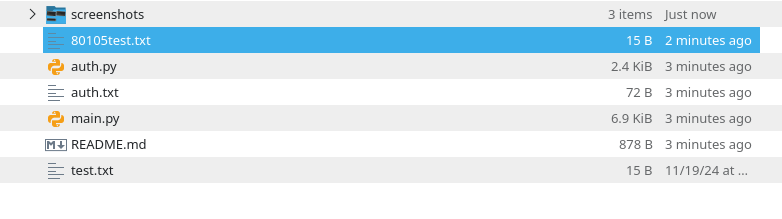

# EECS 563 - Project 2: File Sharing Platform
This is an implementation of the project description for the File Sharing Platform for EECS 563 at KU. 

Name: Xavier Ruyle, 3037294 

## Usage (Setup) 
Have python installed on your machine. 

The implementation has been tested using 3 clients on the same machine 

Run python main.py in the project root directory 

The user should see the following prompt: 
```
❯ python3 main.py 
start tracker (t)
send(s)
file request (f)
check online clients(c)
register (r)?
```

NOTE: Before sending or receiving a file, the user must login (register (r), if they already haven't). There is a test user already in auth.txt if you want to use it (username: xavier, password: test)

- One client should have the tracker started (t)
- Client(s) should send a file to the tracker (s)
- Client(s) should receive a file from the tracker (f)
- If the file info exists in the tracker, the file will be downloaded in the project root directory. 
    - The filename has a random number [0, 100000] assigned to it as a prefix. 

## Example of use  
- Note: Some of these screenshots were taken before checking online clients was implemented 

### Tracker 
Tracker is set up and verifies requests and senders


### Sender 
Sender sends a file test.txt to the tracker and sends file to requester


### File Requester 
File requester requests file test.txt. Tracker verifies this request and a connection is established between sender and requester. Requester downloads the file. 


New test.txt file in the directory 



### Check Online Clients
Example after 127.0.0.0:6001 and 127.0.0.2:6002 sent a file:


## Implementation Details  

### Network Infrastructure 
The tracker acts as a central server where the sender and requester connect to first.

I created a cusutom p2p protocol between sender and tracker, and requester and tracker. 

The tracker can receive a string separated by | 

The sender can send the following to the tracker to send file info to the tracker: 
```
(SEND|FILENAME|client addr it will listen on|client port it will listen on)
```

Requester can send the following to the tracker to request a file: 
```
(REQUEST|FILENAME)
```

Requester can receive the following from the tracker after tracker receives request:
```
(EXISTS|p2p server info)
```
or
```
(NOFILE|p2p server info)
```

Connections are made between tracker and requester, and sender and tracker using the TCP protocol
```python
socket(socket.AF_INET, socket.SOCK_STREAM)
```

Requesting to show all online clients: 
```
(CLIENTS|ALL)
```

### User Authentication 
User authentication is achieved by using an auth.txt file that acts as a database. 

Each line stores:
```
<username|hashed_password>
```

In auth.py, there are functions for logging in and registering. 

Authenticatiion is achieved with hashing. When the user enters a password using the register action, the password will be hashed using sha256.

```python
password = 'test password'
hasher = hashlib.sha256()
hasher.update(password.encode('utf-8'))
hashed_password = hasher.hexdigest()
```
This ensures integrity of passwords. 

### Online Clients 
Each time a client sends a file, it is put in the tracker online_clients dict.
```python
online_clients = {}
def add_online_client(listening_address, listening_port):
    if listening_address not in online_clients: 
        online_clients[listening_address] = listening_port 
```

If a client requests all online clients using the protocol listed above, the tracker responds using this function: 
```python
def get_all_online_clients() -> str: 
    send_string = ""
    for addr in online_clients: 
        port = online_clients[addr]
        client_info = f"{addr}:{port}|"
        send_string += client_info

    return send_string 
```

And then 

```python
clients = get_all_online_clients()
conn.send(clients.encode('utf-8'))
```

Finally the requester receives this info and prints it out to the terminal: 
```python
response = sock.recv(MAX_FILE_SIZE).decode('utf-8').split("|")
print("ONLINE CLIENTS FROM TRACKER (IP:PORT)")
for client in response: 
    print(client)
```

## Potential Problems 
- Could experience an error if you try to send a file larger than 8kb.
